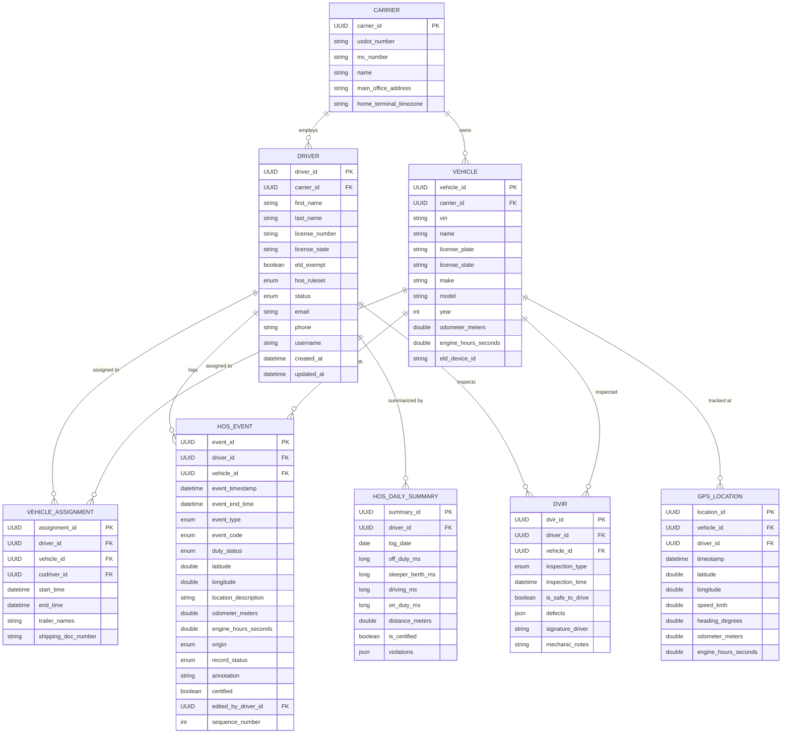

# ELD Unified Data Model

## Overview

This data model provides a single, provider-agnostic schema for ingesting and normalizing data from multiple Electronic Logging Device (ELD) providers. It is grounded in FMCSA regulatory requirements (49 CFR Part 395, Subpart B, Appendix A) and maps to the native APIs of Samsara, Motive (KeepTruckin), Geotab, Verizon Connect, TT ELD, EZLOGZ, and the TruckerCloud aggregator.

The model consists of **8 core entities**, **7 enumeration tables**, and a set of transformation rules that normalize provider-specific field names, units, and conventions into a common format.

---

## Entity Relationship Diagram

---

## Core Entities

### 1. Carrier

The top-level organizational entity representing a motor carrier. Each carrier is identified by its USDOT number and contains one or more drivers and vehicles.

| Field | Type | Description |
|---|---|---|
| carrier_id | UUID | Internal primary key |
| usdot_number | String(8) | FMCSA-issued USDOT number |
| mc_number | String(10) | MC/MX operating authority number |
| name | String(120) | Legal business name |
| main_office_address | String(255) | Principal place of business |
| home_terminal_timezone | String(50) | IANA timezone (e.g. America/Chicago) |

### 2. Driver

Represents an individual CDL holder operating under a carrier. Contains identity, licensing, and HOS ruleset configuration.

| Field | Type | Description |
|---|---|---|
| driver_id | UUID | Internal primary key |
| carrier_id | UUID | FK to Carrier |
| first_name | String(60) | Legal first name |
| last_name | String(60) | Legal last name |
| license_number | String(20) | CDL number |
| license_state | String(2) | Issuing jurisdiction (ISO 3166-2) |
| eld_exempt | Boolean | Whether driver is ELD-exempt |
| hos_ruleset | Enum | Active HOS cycle (e.g. US_70_8) |
| status | Enum | Active, Inactive, or Deactivated |
| email | String(120) | Contact email |
| phone | String(20) | Contact phone |
| username | String(60) | ELD device login |
| created_at | DateTime | Record creation (ISO 8601 UTC) |
| updated_at | DateTime | Last modification (ISO 8601 UTC) |

### 3. Vehicle

Represents a Commercial Motor Vehicle (CMV) registered under a carrier.

| Field | Type | Description |
|---|---|---|
| vehicle_id | UUID | Internal primary key |
| carrier_id | UUID | FK to Carrier |
| vin | String(17) | Vehicle Identification Number |
| name | String(60) | Unit number / fleet name |
| license_plate | String(15) | Plate number |
| license_state | String(2) | Plate issuing state |
| make | String(60) | Manufacturer |
| model | String(60) | Model name |
| year | Integer | Model year |
| odometer_meters | Double | Current odometer (meters) |
| engine_hours_seconds | Double | Total engine hours (seconds) |
| eld_device_id | String(60) | ELD hardware serial/registration ID |

### 4. VehicleAssignment

Tracks which driver is operating which vehicle over time, including co-drivers and trailer information.

| Field | Type | Description |
|---|---|---|
| assignment_id | UUID | Internal primary key |
| driver_id | UUID | FK to Driver |
| vehicle_id | UUID | FK to Vehicle |
| codriver_id | UUID | FK to Driver (nullable, for team driving) |
| start_time | DateTime | Assignment start (ISO 8601 UTC) |
| end_time | DateTime | Assignment end (null = ongoing) |
| trailer_names | String[] | Attached trailer identifiers |
| shipping_doc_number | String(40) | Bill of lading / shipping doc number |

### 5. HosEvent

The core ELD record. Each row represents a single Hours of Service event as defined by FMCSA, including duty status changes, intermediate logs, certifications, logins/logouts, engine power events, and malfunctions.

| Field | Type | Description |
|---|---|---|
| event_id | UUID | Internal primary key |
| driver_id | UUID | FK to Driver |
| vehicle_id | UUID | FK to Vehicle |
| event_timestamp | DateTime | When the event occurred (ISO 8601 UTC) |
| event_end_time | DateTime | When the event ended (nullable) |
| event_type | Enum(1-7) | FMCSA event type per Table 6 |
| event_code | Enum | Sub-code within event type |
| duty_status | Enum | Normalized status: OFF, SB, D, ON, PC, YM |
| latitude | Double | Decimal degrees |
| longitude | Double | Decimal degrees |
| location_description | String(60) | Nearest city/state |
| odometer_meters | Double | Vehicle odometer at event |
| engine_hours_seconds | Double | Engine hours at event |
| origin | Enum(1-4) | How event was created |
| record_status | Enum(1-4) | Active/inactive status |
| annotation | String(60) | Driver or admin comment |
| certified | Boolean | Driver certification flag |
| edited_by_driver_id | UUID | FK to Driver who edited |
| sequence_number | Integer | Sequence within the day |

### 6. HosDailySummary

Aggregated view of a driver's duty status durations for a single 24-hour period.

| Field | Type | Description |
|---|---|---|
| summary_id | UUID | Internal primary key |
| driver_id | UUID | FK to Driver |
| log_date | Date | The 24-hour period (YYYY-MM-DD) |
| off_duty_ms | Long | Off-duty duration (milliseconds) |
| sleeper_berth_ms | Long | Sleeper berth duration (milliseconds) |
| driving_ms | Long | Driving duration (milliseconds) |
| on_duty_ms | Long | On-duty not-driving duration (milliseconds) |
| distance_meters | Double | Total distance driven |
| is_certified | Boolean | Driver certified this day |
| violations | JSON | Array of HOS violation objects |

### 7. GpsLocation

High-frequency GPS breadcrumb trail for vehicle tracking.

| Field | Type | Description |
|---|---|---|
| location_id | UUID | Internal primary key |
| vehicle_id | UUID | FK to Vehicle |
| driver_id | UUID | FK to Driver (nullable) |
| timestamp | DateTime | GPS fix time (ISO 8601 UTC) |
| latitude | Double | Decimal degrees |
| longitude | Double | Decimal degrees |
| speed_kmh | Double | Speed in km/h |
| heading_degrees | Double | Compass heading (0-360) |
| odometer_meters | Double | Odometer at this point |
| engine_hours_seconds | Double | Engine hours at this point |

### 8. DVIR

Driver Vehicle Inspection Report capturing pre-trip, post-trip, and interim inspections.

| Field | Type | Description |
|---|---|---|
| dvir_id | UUID | Internal primary key |
| driver_id | UUID | FK to Driver |
| vehicle_id | UUID | FK to Vehicle |
| inspection_type | Enum | PreTrip, PostTrip, or Interim |
| inspection_time | DateTime | When inspection occurred |
| is_safe_to_drive | Boolean | Vehicle condition satisfactory |
| defects | JSON | Array of defect objects |
| signature_driver | String/URL | Driver signature data |
| mechanic_notes | String(500) | Repair/resolution notes |

---

## Enumeration Tables

### DutyStatus

| Code | Label | Description |
|---|---|---|
| OFF | Off Duty | Driver is off duty |
| SB | Sleeper Berth | Driver is in sleeper berth |
| D | Driving | Driver is driving the CMV |
| ON | On Duty Not Driving | On duty but not driving |
| PC | Personal Conveyance | Authorized personal use of CMV |
| YM | Yard Move | Driving within yard under ON duty |
| WT | Wait Time | Waiting time exemption (oil/gas) |

### EventType (FMCSA Table 6)

| Code | Label |
|---|---|
| 1 | Change in Driver's Duty Status |
| 2 | Intermediate Log (automatic location) |
| 3 | Change in Driver's Indication (PC/YM/WT) |
| 4 | Driver's Certification of Records |
| 5 | Driver Login/Logout |
| 6 | CMV Engine Power-Up / Shut-Down |
| 7 | ELD Malfunction / Data Diagnostic |

### Origin

| Code | Label | Description |
|---|---|---|
| 1 | Auto (ELD) | Automatically recorded by the device |
| 2 | Driver | Manually entered or edited by driver |
| 3 | Other User | Entered by fleet admin or carrier |
| 4 | Unidentified | Recorded under unidentified driver profile |

### RecordStatus

| Code | Label | Description |
|---|---|---|
| 1 | Active | Current active record |
| 2 | Inactive - Changed | Superseded by an edit |
| 3 | Inactive - Change Requested | Edit proposed, pending review |
| 4 | Inactive - Change Rejected | Proposed edit was rejected |

### HosRuleset

| Code | Label |
|---|---|
| US_70_8 | USA Property 70-hour / 8-day |
| US_60_7 | USA Property 60-hour / 7-day |
| US_PASSENGER | USA Passenger-carrying |
| US_SHORT_HAUL | USA 150 air-mile short-haul |
| CA_SOUTH_70 | Canada South of 60th, Cycle 1 |
| CA_SOUTH_120 | Canada South of 60th, Cycle 2 |
| CA_NORTH_80 | Canada North of 60th, Cycle 1 |
| CA_NORTH_120 | Canada North of 60th, Cycle 2 |

### MalfunctionCode

| Code | Label | FMCSA Section |
|---|---|---|
| P | Power compliance | 4.6.1.1 |
| E | Engine synchronization | 4.6.1.2 |
| T | Timing compliance | 4.6.1.3 |
| L | Positioning compliance | 4.6.1.4 |
| R | Data recording compliance | 4.6.1.5 |
| S | Data transfer compliance | 4.6.1.6 |
| O | Other ELD-detected | 4.6.1.7 |

---

## Provider API Field Mapping

### Driver Fields

| Unified Field | Samsara | Motive | Geotab | TT ELD | TruckerCloud |
|---|---|---|---|---|---|
| driver_id | driver.id | user.id | user.id | driver.id | driver_id |
| first_name | driver.name (parsed) | user.first_name | user.firstName | driver.first_name | first_name |
| last_name | driver.name (parsed) | user.last_name | user.lastName | driver.last_name | last_name |
| license_number | driver.licenseNumber | user.drivers_license_number | custom field | — | license_number |
| status | driverActivationStatus | user.status | user.activeTo | driver.status | status |

### Vehicle Fields

| Unified Field | Samsara | Motive | Geotab | TT ELD | TruckerCloud |
|---|---|---|---|---|---|
| vehicle_id | vehicle.id | vehicle.id | device.id | unit.id | vehicle_id |
| vin | vehicle.vin | vehicle.vin | device.vehicleIdentificationNumber | unit.vin | vin |
| name | vehicle.name | vehicle.number | device.name | unit.number | unit_number |
| odometer_meters | obdOdometerMeters | current_odometer (convert from mi) | statusData.odometer | — | odometer |
| engine_hours_seconds | engineHours (sec) | engine_hours (convert from hrs) | engineHours (sec) | — | engine_hours |

### HOS Event Fields

| Unified Field | Samsara | Motive | Geotab | TruckerCloud |
|---|---|---|---|---|
| duty_status | hosStatusType | log.status | DutyStatusLogType | duty_status |
| event_timestamp | hosLog.startTime | log.start_time | dateTime | timestamp |
| latitude | startLocation.latitude | log.latitude | latitude | latitude |
| longitude | startLocation.longitude | log.longitude | longitude | longitude |
| origin | hosLog.origin | log.origin | origin | — |
| annotation | hosLog.remark | log.annotation | annotations[].comment | — |

### GPS Location Fields

| Unified Field | Samsara | Motive | Geotab | TT ELD | TruckerCloud |
|---|---|---|---|---|---|
| latitude | location.latitude | vehicle_location.lat | logRecord.latitude | unit.lat | latitude |
| longitude | location.longitude | vehicle_location.lon | logRecord.longitude | unit.lng | longitude |
| speed_kmh | speedMilesPerHour (x1.609) | speed | speed | unit.speed | speed |
| timestamp | location.time | located_at | dateTime | timestamp | timestamp |

---

## Unit Standardization Rules

All data must be normalized at ingestion time to the following standard units:

| Measurement | Standard Unit | Conversion Notes |
|---|---|---|
| Distance | Meters | Motive may report miles (x 1609.34) |
| Speed | km/h | Samsara reports mph (x 1.60934) |
| Engine hours | Seconds | Motive may report hours (x 3600) |
| Durations | Milliseconds | Some providers use seconds (x 1000) |
| Timestamps | ISO 8601 UTC | Convert from provider-local timezones |
| Coordinates | Decimal degrees (WGS84) | Minimum 5 decimal places |

---

## Authentication by Provider

| Provider | Auth Method | Token Location |
|---|---|---|
| Samsara | Bearer API token | Settings > Developer Tools |
| Motive | API key or OAuth 2.0 | Help Center > API Key Request |
| Geotab | Session-based (Authenticate call) | MyGeotab credentials |
| Verizon Connect | OAuth + developer credentials | Developer portal registration |
| TT ELD | x-api-key header | Dashboard > More > Add Key |
| EZLOGZ | API key | Account settings |
| TruckerCloud | Platform auth | Contact sales |

---

## Implementation Recommendations

**ID Strategy**: Generate internal UUIDs for all entities. Store each provider's native ID in a `provider_external_ids` map for cross-referencing. Use composite keys (provider + external_id) for deduplication.

**Multi-Provider Metadata**: Every record should carry `source_provider` (e.g. "samsara") and `source_raw_payload` (JSONB) columns for audit and debugging.

**Polling Strategy**: Samsara supports webhooks and feed endpoints with pagination cursors. Motive uses page-number polling. Geotab offers the GetFeed method with a fromVersion token for incremental sync. TT ELD is limited to 72-hour windows per request.

**Rate Limits**: Samsara allows ~10 req/sec, Geotab allows 2,500 calls/min per database. Always implement exponential backoff and retry logic.

**TruckerCloud as Middleware**: If multi-provider support is needed without building individual adapters, TruckerCloud provides a single API across 50+ ELD providers. This trades development time for an additional dependency and cost.

---

## Sources

- [Samsara Developer Docs](https://developers.samsara.com/docs/compliance-guide)
- [Motive Developer Hub](https://developer-docs.gomotive.com/reference/introduction)
- [Geotab API Reference](https://developers.geotab.com/myGeotab/apiReference/objects/DutyStatusLog/)
- [TT ELD Developer Portal](https://developer.tteld.com/)
- [EZLOGZ API Integrations](https://ezlogz.com/api-integrations/)
- [Verizon Connect API Toolkit](https://www.verizonconnect.com/services/api-integration/)
- [TruckerCloud](https://truckercloud.com)
- [FMCSA ELD Technical Specs — 49 CFR 395 Appendix A](https://www.law.cornell.edu/cfr/text/49/appendix-A_to_subpart_B_of_part_395)
- [FMCSA ELD Registry](https://eld.fmcsa.dot.gov/list)
